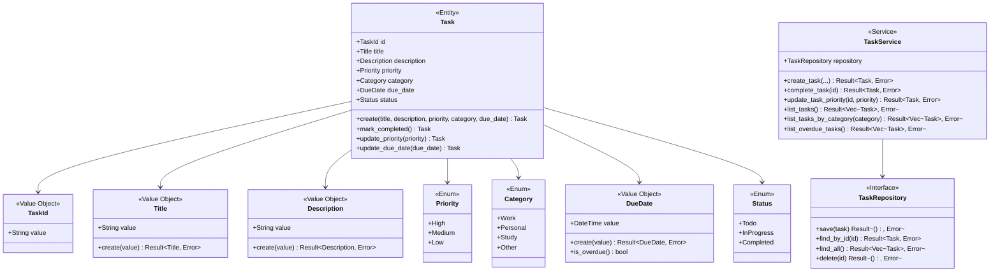
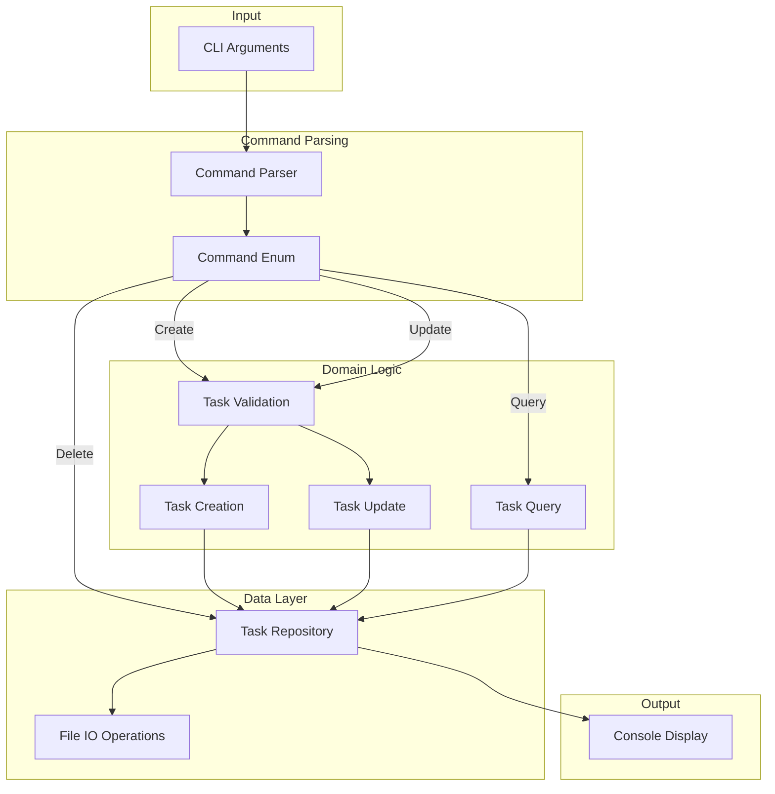

# タスク管理アプリ ドメイン駆動設計の題材
タスク管理アプリを題材にドメイン駆動設計を実施

## ユースケース
- タスクを登録する
- タスクを更新する
- タスクを削除する
- タスクを取得する

## ドメインモデル

```mermaid
classDiagram
    class TaskId {
        <<Value Object>>
        +String value
    }
    
    class Task {
        <<Entity>>
        +TaskId id
        +Title title
        +Description description
        +Priority priority
        +Category category
        +DueDate due_date
        +Status status
        +create(title, description, priority, category, due_date) Task
        +mark_completed() Task
        +update_priority(priority) Task
        +update_due_date(due_date) Task
    }
    
    class Title {
        <<Value Object>>
        +String value
        +create(value) Result~Title, Error~
    }
    
    class Description {
        <<Value Object>>
        +String value
        +create(value) Result~Description, Error~
    }
    
    class Priority {
        <<Enum>>
        +High
        +Medium
        +Low
    }
    
    class Category {
        <<Enum>>
        +Work
        +Personal
        +Study
        +Other
    }
    
    class DueDate {
        <<Value Object>>
        +DateTime value
        +create(value) Result~DueDate, Error~
        +is_overdue() bool
    }
    
    class Status {
        <<Enum>>
        +Todo
        +InProgress
        +Completed
    }
    
    class TaskRepository {
        <<Interface>>
        +save(task) Result~(), Error~
        +find_by_id(id) Result~Task, Error~
        +find_all() Result~Vec~Task~, Error~
        +delete(id) Result~(), Error~
    }
    
    class TaskService {
        <<Service>>
        +TaskRepository repository
        +create_task(...) Result~Task, Error~
        +complete_task(id) Result~Task, Error~
        +update_task_priority(id, priority) Result~Task, Error~
        +list_tasks() Result~Vec~Task~, Error~
        +list_tasks_by_category(category) Result~Vec~Task~, Error~
        +list_overdue_tasks() Result~Vec~Task~, Error~
    }
    
    Task --> TaskId
    Task --> Title
    Task --> Description
    Task --> Priority
    Task --> Category
    Task --> DueDate
    Task --> Status
    TaskService --> TaskRepository
```

## データフロー

```mermaid
flowchart TD
    subgraph "Input"
        CLI[CLI Arguments]
    end
    
    subgraph "Command Parsing"
        Parser[Command Parser]
        Command[Command Enum]
    end
    
    subgraph "Domain Logic"
        TaskValidation[Task Validation]
        TaskCreation[Task Creation]
        TaskUpdate[Task Update]
        TaskQuery[Task Query]
    end
    
    subgraph "Data Layer"
        Repository[Task Repository]
        FileIO[File IO Operations]
    end
    
    subgraph "Output"
        Display[Console Display]
    end
    
    CLI --> Parser
    Parser --> Command
    
    Command -->|Create| TaskValidation
    Command -->|Update| TaskValidation
    Command -->|Query| TaskQuery
    Command -->|Delete| Repository
    
    TaskValidation --> TaskCreation
    TaskValidation --> TaskUpdate
    
    TaskCreation --> Repository
    TaskUpdate --> Repository
    TaskQuery --> Repository
    
    Repository --> FileIO
    Repository --> Display
```
