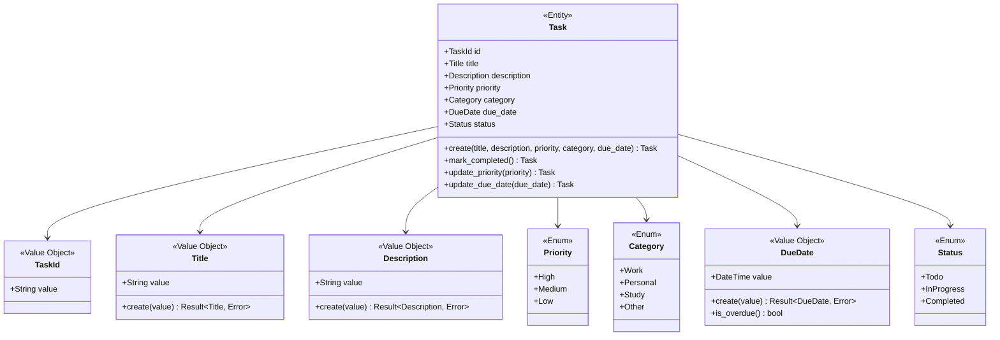

# ドメインモデルの定義

今回の核心は「タスクをいかに管理するか」でしょう。

そしてクライアントは「より便利に」「より簡単に」「より分かりやすく」なるように求めています。これは要求事項に明記されていませんが、お金を出して作ってもらう側として当然の心理です。

## 純粋なドメインモデルから始める

タスク管理の中心はもちろんタスクです。

まず「タスク」という中心的な概念がどのようなものなのか定義することから始め、純粋な関数型ドメインモデルを設計しましょう。
この段階では意図的にIOや外部依存を考慮せず、純粋なビジネスルールとデータ構造に集中します。

まず行うのは「タスクとはなにか」を定義することでしょう。

いくつかは要求事項から読み取ることができます。
タスクにはタスク名がありますし、タスクの説明もあったほうがわかりやすいでしょう。
またタスク名だけでタスクをユニークに区別できるでしょうか？同じタスク名がかぶることもあり得るでしょう。このためにタスクIDも追加します。

これらからタスクとは以下の要素を持つものと定義できます。

- タスクID
- タイトル
- 説明
- 優先度
- カテゴリ分類
- 期限
- 完了状態

あとから柔軟に対応しやすいため、現時点では各要素はそれぞれ独自の型や構造体として定義することとします。

例えばタイトルは文字列で定義しても問題無さそうですが、ひとまずはTitleという型として定義します。

ここで大事なのは現段階ではIOや外部的な要因は全く入っておらず、純粋なデータ構造のみであるということです。

