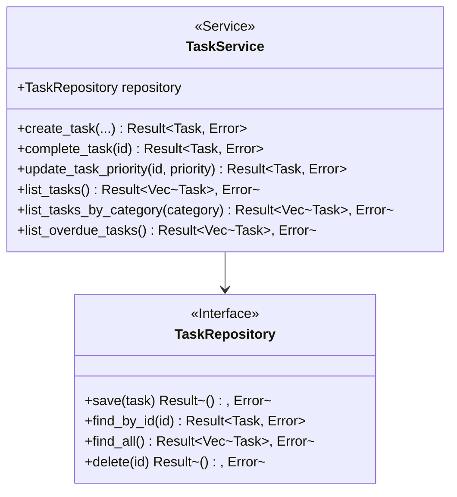

# インターフェースを定義する

純粋なドメインモデルを定義しましたので、次にシステムの境界を特定しましょう。

この取り組みによってIOや副作用を考慮するようになります。

```mermaid
classDiagram
    class TaskRepository {
        <<Interface>>
        +save(task) Result~(), Error~
        +find_by_id(id) Result~Task, Error~
        +find_all() Result~Vec~Task~, Error~
        +delete(id) Result~(), Error~
    }
    
    class TaskService {
        <<Service>>
        +TaskRepository repository
        +create_task(...) Result~Task, Error~
        +complete_task(id) Result~Task, Error~
        +update_task_priority(id, priority) Result~Task, Error~
        +list_tasks() Result~Vec~Task~, Error~
        +list_tasks_by_category(category) Result~Vec~Task~, Error~
        +list_overdue_tasks() Result~Vec~Task~, Error~
    }
    
    TaskService --> TaskRepository
```

